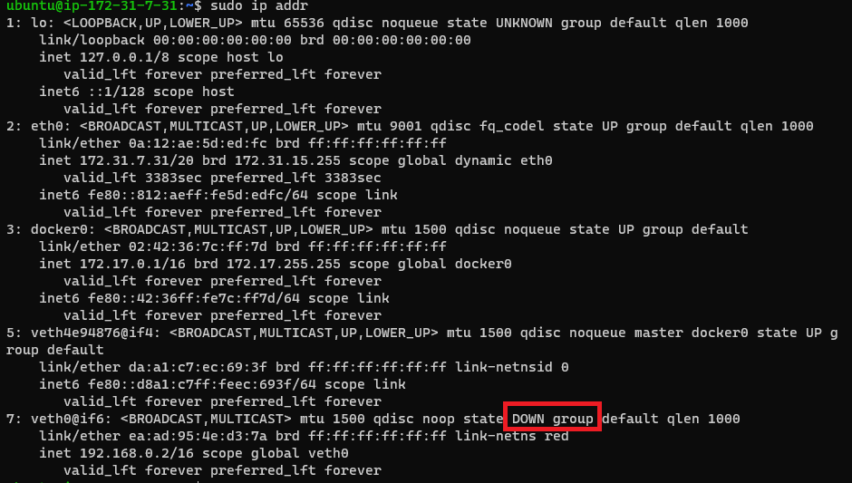
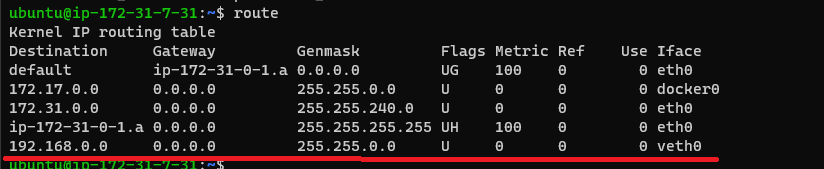
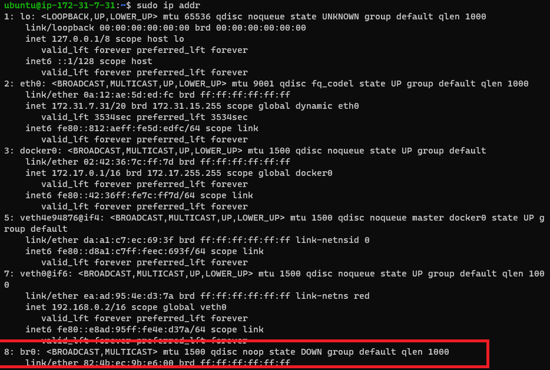
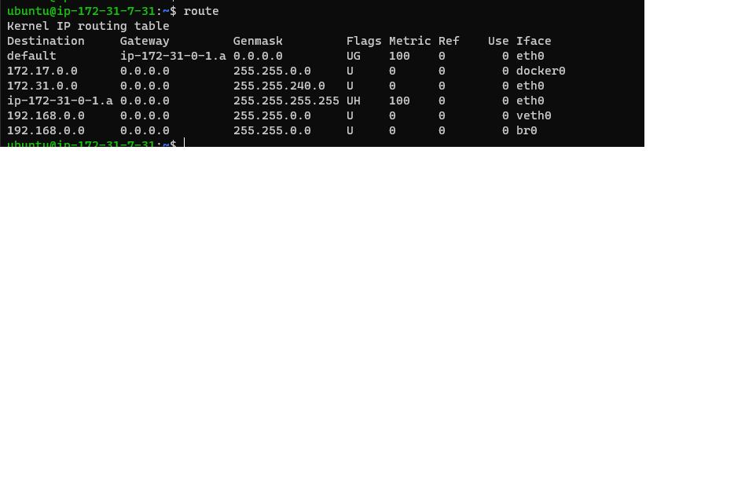

## list of all namespace
``` sudo ip netns list ```

## create a name space

``` sudo ip netns add red ```

## enter to namespace 

``` sudo ip netns exec red sh ```

## tp check routes inside a namespace

``` ip link ```

## see route table also and link 

``` sudo route ```

## create virtual cable  (veth virtual ethernet)

``` sudo ip link add veth0 type veth peer name ceth0 ```

## to check all link list

``` sudo ip link list ``` 

## connect one end of created virtual ethernet to a namespace

``` sudo ip link set ceth0 netns red ```

note so see if the virtual cable attached to your red name space enter namspace and run 

``` ip link ```

u will see the link but it will be down like 

``` 6: ceth0@if7: <BROADCAST,MULTICAST> mtu 1500 qdisc noop state DOWN mode bDEFAULT group default qlen 1000 ```

## so set an ip so that we can up the link

``` ip addr add 192.168.0.3/16 dev ceth0 ```

## now start the link
``` ip link set ceth0 up ``

## now up the another end of virtual ethernet. so goto root name space

```  sudo ip addr add 192.168.0.2/16 dev veth0 ```

note here dev means device

result  

## now start the link
``` ip link set ceth0 up ``

## to check if the ip is set 
``` sudo ip addr ```

## now see route table using
``` route ```
result  

## now ping to see the packet is going

``` ping 192.168.0.3 ```

Note: this solution is not scalable. why??  that if there is an another container we have to create another cable and set ip. but to access from outside we have to create a route table to tell eth0 that goto veth0. but for two container its not usable. so for that we have to create a bridge.  


## create a new namaspace
``` sudo ip netns add  yellow ```
## now create a bridge (br0)
``` sudo ip link ad br0 type bridge ``` 
on layer two 
result  
## up the br0

```sudo ip link set br0 up```
status unknown??? but why???

## now to goto bridge br0 we have to create interface. So set an ip there 

``` sudo ip addr add 192.168.0.1/16 dev br0 ```

## now create a cable to connect br0 to eth0 

``` sudo ip link add veth1 type veth peer name ceth1 ```

## now set the one end of cable to yellow and another to br0

``` sudo ip link set veth1 master br0 ```
## enter name space yellow
``` sudo ip netns exec yellow sh ```
## check ip table
``` ip link ```
## up the interfacees

``` ip link set lo up ```
``` ip link set ceth1 up ```

## add an address to ceth1
``` ip addr add 192.168.0.2/16 dev ceth1 ```
``` ip addr ```
## now if lowerlayer is own then goto root namspace and up the veth1

``` sudo ip link set veth1 up ```

## now goto namespace yellow and check

``` ping 8.8.8.8 ```

it can't access internet

## now exit and see root namespace can access internet 

``` ping 8.8.8.8  ```

so its can how is he doing that, so check route table

``` route ```
result 


## check yellow route table

result 


## so to access internet from yellow ns add a default getway

``` ip route add default via 192.168.0.1 ```

``` route -n ```


